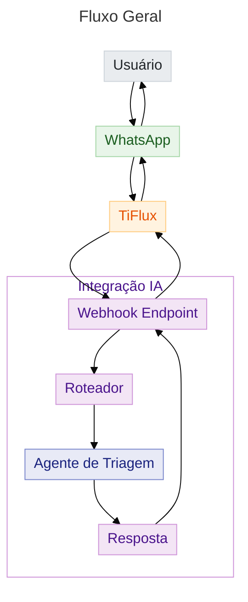
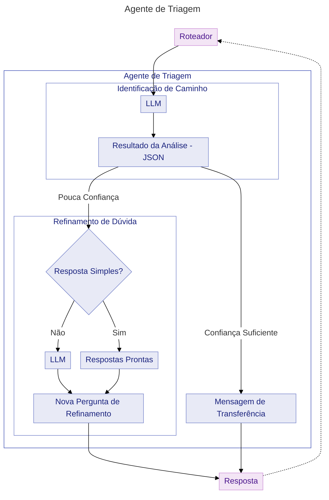

# Fluxo

- *Webhook* recebe a mensagem, classifica por meio de métodos determinísticos e LLM, gerando resposta com base na classificação
	- Também identifica informações como tom, sistema, situação... para uso posterior
	- Para respostas mais simples, usa *templates* pré-definidos, com prevenção de repetição

## Fluxo geral

## Agente de triagem

